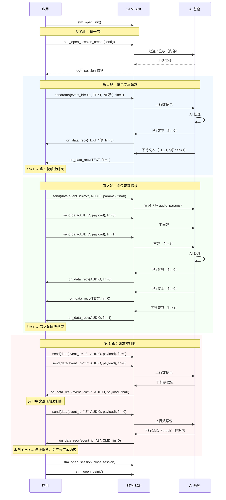

# STM SDK 使用文档

## 1. 概述

### 1.1 SDK 简介

**STM SDK** 面向**外部开发者**，在标准 STM SDK 的基础上做了流程简化，便于快速接入 AI 能力，无需理解 Connect、Stream、Event 等底层概念。

---

### 1.2 核心概念

#### 1.2.1 Session（会话）

**定义：**  
Session 表示**AI业务会话**，对应一个独立的对话或任务上下文。创建 Session 时需传入由服务端下发的 **session_token**；SDK 内部会据此完成连接与鉴权。

**生命周期：**  
- **创建**：调用 `stm_open_session_create(stm_open_session_config_t *config)`，传入 client_type、token、id、encrypt_key 及回调（如 `on_state`、`on_data_recv`），成功则返回 `stm_open_session_t*`。  
- **使用**：在同一 Session 上多次调用 `stm_open_session_send` 发送请求数据，在 `on_data_recv` 中接收 AI 返回。  
- **关闭**：业务结束或不再需要该会话时调用 `stm_open_session_close(session)` 释放资源。

**举例：**  
用户打开一个「与 AI 对话」的页面 → 应用调用平台接口获取 session_token 和 session_id → 用 STM SDK 创建该 Session → 用户发送文字或语音时通过 `stm_open_session_send` 发送，在 `on_data_recv` 里收到 AI 的回复并展示；用户离开页面时调用 `stm_open_session_close`。

---

#### 1.2.2 请求与数据包（event_id、fin）

**定义：**  
一次完整的「请求-响应」在数据上可能由**多包**组成（例如一段语音拆成多帧上传）。STM SDK 用 **事件** 来刻画这样一组包：同一轮请求/返回包共享同一个 **event_id**，**首包**可携带数据类型和参数（如音频采样率、图像宽高），**末包**通过参数 **fin=1** 标记，便于基座和端侧对齐「这一段输入已结束」。

**发送侧（你调用 `stm_open_session_send` 时）：**

- **event_id**：事件 ID，仅在本事件的**第一包**里填写（后续包可置空或沿用同一 ID，以协议约定为准），用于基座和业务层关联同属一次请求的多个数据包。  
- **data_type**：数据类型（如文本、音频、图像等），首包时必填；首包还可通过 union 填写对应的 **video_params / audio_params / image_params** 等，描述编码、分辨率等。  
- **payload / payload_length**：本包的数据内容。  
- **fin**：**0** 表示后面还有包，**1** 表示本包是该事件的**最后一包**，基座收到 fin=1 后会对本次请求做统一处理。

**接收侧（`on_data_recv` 回调）：**

- 回调参数中的 **fin**：**0** 表示本轮 AI 返回还未结束，后续还会有数据包到达；**1** 表示本条响应的**最后一包**，可用于更新 UI（如“生成中” → “生成完成”）。  
- 通过 **data** 中的 `data_type`、`payload` 等区分文本、音频、图片等，按类型解码或处理，通过 `event_id` 来关联本轮 AI 请求。

**举例：**  
- **文本单轮对话**：发一包文本，`fin=1`；收到多包或单包文本回复，最后一包 `fin=1`。  
- **语音多包上传**：第一包带 `event_id`、`data_type=音频`、音频参数和第一段 payload、`fin=0`；后续包只带 payload、`fin=0`；最后一包 `fin=1`，基座开始识别并返回结果。

---

## 2. 前期准备

在接入 STM SDK 前，需在平台上完成智能体配置与设备激活，并通过接口获取创建会话所需的 **session_token** 与 **session_id**。本节说明这些前置步骤，便于开发者从零跑通一条完整链路。

### 2.1 智能体配置

（待补充：描述如何在平台配置智能体。）

### 2.2 设备激活

（待补充：描述设备的标准激活流程。）

### 2.3 获取 session token

（待补充：调用 atop 等接口获取创建 Session 的配置信息，重点包括 **session_token** 与 **session_id**，用于在 4.1 节中调用 `stm_open_session_create`。）

---

## 3. SDK 初始化与配置

在使用会话与收发数据前，必须先完成 STM SDK 的初始化与可选配置（如日志回调、日志级别）。本节介绍初始化、重置、反初始化、版本查询与日志配置等 API。

### 3.1 SDK 初始化（`stm_open_init`）

**函数原型：**
```c
stm_ret stm_open_init(stm_open_config_t *config);
```

**功能描述：**  
初始化 STM SDK，设置日志回调等基础配置。该函数必须在调用其他 STM SDK API 之前调用，且在整个应用生命周期内只能调用一次（除非先调用 `stm_open_deinit`进行卸载）。

**参数说明：**

| 参数名 | 类型 | 说明 |
|--------|------|------|
| config | `stm_open_config_t *` | STM SDK 配置结构体指针，不能为 NULL |

**返回值：**

| 返回值 | 说明 |
|--------|------|
| `STM_OK` | 初始化成功 |
| `STM_EINVALID_PARM` | 参数无效（config 为 NULL 或配置不合法） |
| 其他负数 | 初始化失败，参见 `stm_errno.h` |

**配置结构体 `stm_open_config_t`：**

| 字段名 | 类型 | 说明 |
|--------|------|------|
| `on_log` | `stm_log_cb_t` | 日志回调函数指针，用于接收 SDK 输出的日志。可为 NULL，表示不接收日志 |

---

### 3.2 SDK 重置（`stm_open_reset`）

**函数原型：**
```c
stm_ret stm_open_reset(stm_open_config_t *config);
```

**功能描述：**  
将 STM SDK 重置到初始状态，释放所有会话等资源，并重新应用配置。调用后需重新创建 Session 才能继续使用；若需完全卸载，应使用 `stm_open_deinit`。

**参数说明：**

| 参数名 | 类型 | 说明 |
|--------|------|------|
| config | `stm_open_config_t *` | 新的配置结构体指针，不能为 NULL，字段说明同 `stm_open_init` |

**返回值：**

| 返回值 | 说明 |
|--------|------|
| `STM_OK` | 重置成功 |
| `STM_ENOT_INIT` | SDK 未初始化 |
| `STM_EINVALID_PARM` | 参数无效（config 为 NULL） |

---

### 3.3 SDK 反初始化（`stm_open_deinit`）

**函数原型：**
```c
void stm_open_deinit(void);
```

**功能描述：**  
反初始化 STM SDK，释放占用的所有资源。调用后所有会话会被关闭，需要重新调用 `stm_open_init` 才能再次使用 SDK。

**参数说明：**  
无。

**返回值：**  
无（`void`）。

**注意事项：**
- 建议在调用前先关闭所有已创建的 Session（`stm_open_session_close`）。
- 反初始化后，再次调用除 `stm_open_init` 以外的 API 可能产生未定义行为或返回错误。

---

### 3.4 获取版本信息（`stm_open_get_version`）

**函数原型：**
```c
uint32_t stm_open_get_version(void);
```

**功能描述：**  
获取 STM SDK 的版本号。版本号为 32 位整数，通常高 8 位为主版本、中 8 位为次版本、低 16 位为修订号。

**参数说明：**  
无。

**返回值：**

| 返回值类型 | 说明 |
|-----------|------|
| `uint32_t` | 版本号，例如 0x010000 表示 1.0.0 |

---

### 3.5 日志配置（`stm_open_set_log_level`）

**函数原型：**
```c
stm_ret stm_open_set_log_level(stm_log_level_e level);
```

**功能描述：**  
设置 STM SDK 的日志输出级别。仅级别不低于所设级别的日志会通过 `on_log` 回调输出，便于在开发时打开详细日志、在生产环境降低噪音。

**参数说明：**

| 参数名 | 类型 | 说明 |
|--------|------|------|
| level | `stm_log_level_e` | 日志级别，取值见下表 |

**日志级别定义：**

| 级别值 | 宏定义 | 说明 |
|--------|--------|------|
| 0 | `STM_LOG_LEVEL_VERBOSE` | 最详细 |
| 1 | `STM_LOG_LEVEL_DEBUG` | 调试 |
| 2 | `STM_LOG_LEVEL_INFO` | 信息（推荐生产环境） |
| 3 | `STM_LOG_LEVEL_WARN` | 警告 |
| 4 | `STM_LOG_LEVEL_ERROR` | 错误 |
| 5 | `STM_LOG_LEVEL_FATAL` | 致命错误 |
| 6 | `STM_LOG_LEVEL_NONE` | 不输出任何日志 |

**返回值：**

| 返回值 | 说明 |
|--------|------|
| `STM_OK` | 设置成功 |
| `STM_ENOT_INIT` | SDK 未初始化 |
| `STM_EINVALID_PARM` | level 取值不合法 |

---

## 4. 会话管理

STM SDK 以 Session 为核心：创建会话后即可在该会话上发送数据、接收 AI 返回。本节说明如何创建会话、发送数据、关闭会话，以及会话状态与接收回调的含义。

### 4.1 创建会话（`stm_open_session_create`）

**函数原型：**
```c
stm_open_session_t* stm_open_session_create(stm_open_session_config_t *config);
```

**功能描述：**  
使用平台下发的 session_token 与 session_id 创建业务会话。创建成功后返回会话句柄，用于后续发送数据与关闭会话；SDK 内部会据此完成连接建立与鉴权，开发者无需关心底层 Connect。

**参数说明：**

| 参数名 | 类型 | 说明 |
|--------|------|------|
| config | `stm_open_session_config_t *` | 会话配置结构体指针，不能为 NULL |

**返回值：**

| 返回值 | 说明 |
|--------|------|
| 非 NULL | 会话创建成功，返回 `stm_open_session_t*` 句柄，用于 `stm_open_session_send` 与 `stm_open_session_close` |
| NULL | 创建失败（如未初始化、token 无效、网络异常等），可结合日志排查 |

**配置结构体 `stm_open_session_config_t`：**

| 字段名 | 类型 | 说明                                               |
|--------|------|--------------------------------------------------|
| `client_type` | `stm_client_type_e` | 客户端类型，用于标识接入端的类型                                 |
| `session_token` | `char *` | 会话令牌，由平台/atop 等接口获取，不能为 NULL                     |
| `session_id` | `char *` | 会话 ID，用于标识本会话，不能为 NULL。由平台分配或开发者自定义，建议在同一设备内保持唯一 |
| `encrypt_key` | `char *` | 加密密钥，用于会话数据加密，不能为 NULL ，设备固定传local_key           |
| `on_state` | `stm_open_session_on_state_cb_t` | 会话状态变化回调，可为 NULL                                 |
| `on_data_recv` | `stm_open_session_on_data_recv_cb_t` | 接收 AI 返回数据的回调，不能为 NULL                           |
| `app_data` | `char *` | 应用自定义数据，会透传到各回调，可为 NULL                          |
| `user_data` | `void *` | 用户自定义指针，会透传到各回调的 `user_data` 参数，可为 NULL          |
| `max_fragment_size` | `int` | 客户端声明的最大分片大小（字节）。0/不设置表示使用默认值，有效范围 [512,1184]，超出范围按默认 1184 处理 |

**回调类型说明：**

- **状态回调** `stm_open_session_on_state_cb_t`：
  ```c
  void (*)(stm_open_session_t *session, uint16_t state, void *user_data);
  ```
  当会话状态变化（如连接成功、断开、错误等）时触发，`state` 取值由协议或业务约定，见 4.4 节。

- **接收回调** `stm_open_session_on_data_recv_cb_t`：
  ```c
  void (*)(stm_open_session_t *session, stm_open_data_t *data, int8_t fin, void *user_data);
  ```
  当收到 AI 下发的数据时触发；`data` 为本次数据包，`fin` 表示该条响应是否结束（1=最后一包），详见第 5 章。

---

### 4.2 发送数据（`stm_open_session_send`）

**函数原型：**
```c
stm_ret stm_open_session_send(stm_open_session_t *session, stm_open_data_t *data, int8_t fin);
```

**功能描述：**  
在指定会话上发送一条上行数据包（如文本、音频、图像等）。同一请求若拆成多包发送，首包可带 `event_id` 与数据类型参数，末包需将 `fin` 置为 1，以便基座识别请求边界并开始处理。

**参数说明：**

| 参数名 | 类型 | 说明 |
|--------|------|------|
| session | `stm_open_session_t *` | 由 `stm_open_session_create` 返回的会话句柄，不能为 NULL |
| data | `stm_open_data_t *` | 本包数据（event_id、data_type、params、payload 等），不能为 NULL，字段说明见第 5.1 节 |
| fin | `int8_t` | 是否为本事件最后一包：0=还有后续包，1=最后一包，基座收到 fin=1 后会对整次请求做处理 |

**返回值：**

| 返回值 | 说明 |
|--------|------|
| `STM_OK` | 发送成功（已写入发送队列或发出） |
| `STM_ENOT_INIT` | SDK 未初始化 |
| `STM_EINVALID_PARM` | 参数无效（session 或 data 为 NULL，或数据不合法） |
| 其他负数 | 发送失败，参见 `stm_errno.h` |

多包发送、首包带音频/图像参数等用法见第 5.1 节与第 7 章示例。

---

### 4.3 关闭会话（`stm_open_session_close`）

**函数原型：**
```c
void stm_open_session_close(stm_open_session_t *session);
```

**功能描述：**  
关闭指定会话，释放与该会话相关的资源。关闭后不可再使用该句柄调用 `stm_open_session_send`；若需继续与 AI 交互，应重新调用 `stm_open_session_create` 创建新会话。

**参数说明：**

| 参数名 | 类型 | 说明 |
|--------|------|------|
| session | `stm_open_session_t *` | 要关闭的会话句柄，不能为 NULL |

**返回值：**  
无（`void`）。

**注意事项：**
- 关闭后，该 session 指针不再有效，不应再被使用。
- 建议在业务会话结束、页面退出或不再需要该会话时调用，避免资源泄漏。

---

### 4.4 会话状态说明

**状态回调 `on_state` 的 `state` 参数：**  
`state` 为 `uint16_t`，具体取值由**协议或业务约定**。常见约定可包括（以实际协议为准）：

| 含义（示例） | 说明 |
|--------------|------|
| 连接/会话就绪 | 可以开始发送数据 |
| 连接断开/异常 | 会话不可用，需关闭并可能重新创建 |
| 被服务端关闭 | 服务端主动结束会话 |

若协议文档中有明确的状态码表，请以协议为准；无约定时可在回调中打印 `state` 便于联调，或咨询平台侧。

**接收回调 `on_data_recv`：**  
在 1.2.2 与第 5 章中已说明：通过 `data->data_type` 区分文本、音频、图像等，通过 `fin` 判断当前响应是否结束。回调最后一个参数为 `user_data`，即创建 Session 时传入的 `user_data` 指针。系统指令（如打断）处理见 5.2 节。

---

## 5. AI 调用与数据传输

本节用**流程图**和**字段说明**把「从初始化、创建 Session 到发送请求、接收 AI 返回」的完整数据流讲清楚，重点说明：上行如何组包（event_id、data_type、payload、fin）、下行如何根据 data_type 与指令类型（如 CMD 表示系统指令，如 break 表示聊天被打断）做处理。

### 5.0 整体数据流

从 SDK 初始化到多轮「发请求 → 收响应」的完整流程如下（具体示例见第 7 章）：



---

### 5.1 发送 AI 调用请求数据

上行数据通过 `stm_open_session_send(session, data, fin)` 发送，其中 `data` 为 `stm_open_data_t`。同一事件若拆成多包，**首包**需带 `event_id`、`data_type` 及对应参数（union），**末包**将 `fin` 置为 1。

**数据结构 `stm_open_data_t`：**

| 字段名 | 类型 | 说明 |
|--------|------|------|
| `event_id` | `char *` | 事件ID，由业务指定，保证session内唯一。**事件首包必填**，后续包可置 NULL 或沿用同一 ID（以协议约定为准） |
| `data_type` | `stm_data_type_e` | 数据类型，见下表。**事件首包必填**，后续包可沿用或按协议填写 |
| `params*`  | `union` | **事件首包必填**。根据 `data_type` 填写对应成员：`video_params` / `audio_params` / `image_params` / `file_params` / `text_params`，描述编码、分辨率、采样率等，供基座正确解析 payload |
| `payload` | `uint8_t *` | 本包负载数据（文本 UTF-8、音频帧、图像二进制等）。需指向有效内存；若本包无负载可为 NULL 且 `payload_length` 设为 0 |
| `payload_length` | `uint32_t` | 负载长度（字节） |
| `app_data` | `char *` | 应用自定义透传数据，可选，可为 NULL |

**上行常用 `data_type`（发送时）：**

| 值 | 宏 | 说明 | union 成员 |
|----|-----|------|-------------|
| 2 | `STM_DATA_TYPE_VIDEO` | 视频 | `video_params` |
| 3 | `STM_DATA_TYPE_AUDIO` | 音频 | `audio_params` |
| 4 | `STM_DATA_TYPE_IMAGE` | 图像 | `image_params` |
| 5 | `STM_DATA_TYPE_FILE` | 文件 | `file_params` |
| 6 | `STM_DATA_TYPE_TEXT` | 文本 | `text_params` |

**参数结构体说明（首包按 `data_type` 填写对应 union 成员）：**

以下 params 与标准 STM SDK 共用，定义在 `stm_typedef.h` 中。**仅首包有效**，后续包通常只需 `payload` / `payload_length` 与 `fin`。

**1. `video_params`（`stm_video_params_t`）— 视频**

| 字段名 | 类型 | 说明                         |
|--------|------|----------------------------|
| `codec_type` | `uint16_t` | 视频编码类型，可选项： 2-H264, 4-H265 |
| `sample_rate` | `uint32_t` | 视频采样率（Hz），通常用于时间戳计算，可设为帧率  |
| `width` | `uint16_t` | 视频宽度（像素），如 1920、1280、720   |
| `height` | `uint16_t` | 视频高度（像素），如 1080、720、480    |
| `fps` | `uint16_t` | 帧率（帧/秒），如 24、25、30、60      |
| `container` | `uint16_t` | 容器格式，可选项： 0-裸流             |
| `bitrate` | `uint32_t` | 码率（bps），如 2000000（2Mbps）   |

**2. `audio_params`（`stm_audio_params_t`）— 音频**

| 字段名 | 类型 | 说明                                |
|--------|------|-----------------------------------|
| `codec_type` | `uint16_t` | 音频编码类型，可选项：101-PCM, 108-SPEEX, 109-MP3 |
| `sample_rate` | `uint32_t` | 采样率（Hz），可选项： 8000、16000、44100、48000 |
| `channels` | `uint16_t` | 声道数，可选项：1-单声道                     |
| `bit_depth` | `uint16_t` | 位深度（比特/采样），可选项： 8、16              |
| `container` | `uint16_t` | 容器格式，可选项：0-裸流，1-ogg               |
| `bitrate` | `uint32_t` | 码率（bps）                           |
| `frame_duration` | `uint16_t` | 帧时长（ms）                           |
| `frame_size` | `uint16_t` | 帧大小（字节）                           |

**3. `image_params`（`stm_image_params_t`）— 图像**

| 字段名 | 类型 | 说明 |
|--------|------|------|
| `payload_type` | `uint8_t` | 0-raw（二进制）, 1-base64, 2-url |
| `format` | `uint8_t` | 图像格式，1-jpeg, 2-png |
| `width` | `uint16_t` | 图像宽度（像素），可选 |
| `height` | `uint16_t` | 图像高度（像素），可选 |

**4. `file_params`（`stm_file_params_t`）— 文件**

| 字段名 | 类型 | 说明                                                  |
|--------|------|-----------------------------------------------------|
| `payload_type` | `uint8_t` | 0-raw, 1-base64, 2-url                              |
| `format` | `char[STM_FILE_FORMAT_MAX_LEN + 1]` | 文件格式描述字符串（通常即扩展名，不含 `.`），如 `"mp4"` / `"ogg"` / `"pdf"` / `"json"`；最大 31 字节，不得含空格 |
| `name` | `char[]` | 文件名，最大长度 `STM_FILE_NAME_MAX_LEN`                    |

**5. `text_params`（`stm_text_params_t`）— 文本**
| 字段名 | 类型 | 说明 |
|--------|------|------|


文本类型通常无需额外参数，union 中 `text_params` 可为空结构体，payload 直接携带 UTF-8 文本即可。

**发送约定小结：**
- **单包请求**（如一句文本）：首包即末包，`event_id`、`data_type`、payload 填好，`fin=1`。
- **多包请求**（如一段语音）：首包填 `event_id`、`data_type`、对应 params、首段 payload、`fin=0`；中间包填 payload、`fin=0`；末包填最后一段 payload、`fin=1`。

---

### 5.2 接收 AI 处理返回

下行数据通过创建 Session 时注册的 **`on_data_recv`** 回调推送，原型为：

```c
void on_data_recv(stm_open_session_t *session, stm_open_data_t *data, int8_t fin, void *user_data);
```

- **session**：当前会话句柄。  
- **data**：本包数据，含 `data_type`、`payload`、`payload_length` 及首包时的参数 union。  
- **fin**：**0** 表示该条 AI 响应还有后续包，**1** 表示本包为该条响应的**最后一包**，可用于更新 UI 状态（如“生成中” → “生成完成”）。
- **user_data**：创建 Session 时传入的 `user_data` 指针。

**按 `data_type` 处理：**

下行 `data->data_type` 使用与 `stm_typedef.h` 中一致的 `stm_data_type_e` 枚举，处理方式建议如下：

| 值 | 宏 | 说明 | 处理建议 |
|----|-----|------|----------|
| 1 | `STM_DATA_TYPE_CMD` | **系统指令** | 表示基座下发的控制类指令，非业务数据。当前常见为**聊天被打断**（如用户说话打断 AI 回复）。可根据 `payload` 或协议约定解析具体指令（如 break），停止播放 TTS、清空未完成内容等 |
| 2 | `STM_DATA_TYPE_VIDEO` | 视频 | 按协议解析 `payload` 为视频帧或 URL，首包可能有 `video_params` |
| 3 | `STM_DATA_TYPE_AUDIO` | 音频 | 多为 TTS 音频，按 `audio_params` 与 payload 解码播放；可与文本混合到达 |
| 4 | `STM_DATA_TYPE_IMAGE` | 图像 | 文生图/理解结果等，按 `image_params` 与 payload 解码展示 |
| 5 | `STM_DATA_TYPE_FILE` | 文件 | 文件类结果，按 `file_params` 与 payload 处理 |
| 6 | `STM_DATA_TYPE_TEXT` | 文本 | AI 回复文本，通常为 UTF-8，可直接展示或与音频配合 |

**CMD 类型说明：**  
`STM_DATA_TYPE_CMD` 专用于**系统指令**，不表示业务内容。目前典型用法为**打断（break）**：例如语音对话中用户中途说话，基座会下发 CMD 表示当前回复被打断，端侧应在收到后停止播放当前 TTS、丢弃后续未完成的该条响应包（直至收到 fin=1 或下一条新响应）。具体 CMD 子类型或 payload 格式以协议/平台约定为准。

---

## 6. 错误处理

接口通过返回值 `stm_ret`（`int32_t`）表示成功或失败：**成功为 `STM_OK`（0）**，失败为负数错误码，定义在 `stm_errno.h`。本节列出 STM SDK 可能返回的各类错误码及**处理建议**。

### 6.1 返回值与错误码

**成功：**

| 返回值 | 宏 | 说明 |
|--------|-----|------|
| 0 | `STM_OK` | 执行成功 |

**错误码列表与处理建议：**

| 值 | 宏 | 含义 | 处理建议 |
|----|-----|------|----------|
| -1 | `STM_ENOT_INIT` | 未初始化 | 确保在调用其他 API 前已调用 `stm_open_init`；若已 deinit，需重新 init |
| -2 | `STM_EINIT_MORE_THAN_ONCE` | 初始化超过一次 | 不要重复调用 `stm_open_init`；若需重新配置，先 `stm_open_deinit` 再 init，或使用 `stm_open_reset` |
| -3 | `STM_ETIMEOUT` | 超时 | 检查网络与基座可用性，适当重试；必要时提示用户检查网络 |
| -4 | `STM_EINVALID_PARM` | 无效入参 | 检查指针非 NULL、config/session/data 字段合法（如 token/id 非空、payload_length 与 payload 一致） |
| -5 | `STM_ENOT_CONNECTED` | 连接未建立 | 多为 session 尚未就绪；等待 `on_state` 就绪后再发数据，或检查 token 是否有效 |
| -6 | `STM_ECONNECTION_CLOSED` | 连接已关闭 | 会话已不可用，调用 `stm_open_session_close`，需重新获取 token 并创建新 session |
| -7 | `STM_EOUT_OF_CONNECTION` | 连接数已满 | 关闭不用的 session 后再创建新会话，或联系平台确认连接数限制 |
| -8 | `STM_EMALLOC_FAILED` | 内存分配失败 | 检查设备内存与泄漏；可稍后重试或降级功能 |
| -9 | `STM_EAUTH_FAILED` | 校验失败 | 检查 session_token、设备鉴权信息是否正确；重新从平台获取 token |
| -10 | `STM_EHEARTBEAT_TIMEOUT` | 心跳超时 | 网络不稳定或基座无响应；提示用户检查网络，关闭当前 session 后重连 |
| -11 | `STM_EINVALID_TOKEN` | 无效 TOKEN | session_token 无效或格式错误；重新调用平台接口获取有效 token |
| -12 | `STM_ETIME_OUT_NO_ANSWER` | 超时未收到响应 | 基座未在约定时间内响应；可重试本次请求或提示用户 |
| -13 | `STM_ETIME_OUT_LOCAL_NAT` | 本地网络异常 | 检查本机网络、防火墙、DNS；提示用户检查网络设置 |
| -14 | `STM_ETIME_OUT_REMOTE_NAT` | 对端网络异常 | 基座或中间网络异常；稍后重试或联系平台 |
| -15 | `STM_ETOKEN_EXPIRED` | token 过期 | 重新获取 session_token 并创建新 session |
| -16 | `STM_ETOKEN_AUTH_FAILED` | token 校验失败 | 确认 token 未过期、未重复使用；重新获取 token |
| -17 | `STM_EINTERNAL_ERROR` | 内部错误 | 记录日志与复现步骤，升级 SDK 或联系支持 |
| -18 | `STM_ENET_ERROR` | 网络错误 | 检查网络连通性；重试或提示用户 |
| -19 | `STM_ENOT_SUPPORTED` | 不支持 | 当前接口或参数不被支持；查阅文档或升级 SDK |
| -20 | `STM_ENOT_FOUND` | 没有找到对象 | 如 session 已关闭仍被使用；确保使用有效的 session 句柄 |
| -21 | `STM_EBUFFER_NOT_ENOUGH` | 缓存不足 | 单包 payload 过大或发送过快；减小单包大小（建议 ≤200KB）或控制发送节奏 |
| -22 | `STM_ERECV_DA_NOT_ENOUGH` | 接收数据不完整 | 多为网络丢包或中断；可等待后续包或按业务做超时/重试 |
| -23 | `STM_ECMD_BUFFER_FULL` | CMD 缓存满 | 发送过快；流控或稍后重试 |
| -24 | `STM_ECREATE_STREAM_FAILED` | 创建流失败 | SDK 内部建流失败；重试创建 session 或检查资源限制 |
| -25 | `STM_ERECV_NO_DATA` | 无接收数据 | 当前无数据可读；非致命，可按需重试 |
| -26 | `STM_ERECV_DATA_UNMARSHAL_FAILED` | 接收数据反序列化失败 | 协议或数据异常；记录 payload 便于排查，可丢弃本包 |
| -27 | `STM_EAGAIN` | 需要重试（非阻塞） | 操作暂未就绪；稍后重试同一操作 |
| -28 | `STM_ETIMEDOUT` | 操作超时 | 单次操作超时；重试或加大超时时间（若可配置） |
| -29 | `STM_ESSL_HANDSHAKE_FAILED` | SSL/TLS 握手失败 | 检查时间、证书、网络；确认基座地址与端口正确 |
| -30 | `STM_ESSL_WRITE_FAILED` | SSL 写入失败 | 连接可能已断开；关闭 session 后重连 |
| -31 | `STM_ESSL_READ_FAILED` | SSL 读取失败 | 同上，检查连接状态 |
| -32 | `STM_ESSL_CONN_CLOSED` | SSL 连接关闭 | 对端关闭连接；正常关闭 session，需新建 session |
| -33 | `STM_EENCRYPT_FAILED` | 加密失败 | 内部加密异常；重试或联系支持 |
| -34 | `STM_EDECRYPT_FAILED` | 解密失败 | 解密异常（数据损坏或密钥不一致）；丢弃本包或重连 |
| -35 | `STM_ESSL_CERT_PARSE_FAILED` | 证书解析失败 | 检查系统时间与证书链；联系平台获取正确证书或配置 |
| -36 | `STM_ESSL_CERT_VERIFY_FAILED` | 证书验证失败 | 证书不受信或过期；确认证书配置与系统时间 |
| -37 | `STM_ESSL_NO_PEER_CERT` | 无对端证书 | 服务端未提供证书；确认基座 TLS 配置 |
| -38 | `STM_ESSL_CERT_INFO_FAILED` | 获取证书信息失败 | 证书信息读取失败；检查证书有效性 |

**使用建议：** 调用返回后若 `ret != STM_OK`，可根据上表打印或上报错误码，并执行对应处理（重试、重新获取 token、关闭 session、提示用户等）。

---

## 7. 快速开始

本节提供**集成步骤**与**精简示例**（文本聊天、音频聊天、文生图），关键处已加注释。完整流程见第 3、4、5 章。

### 7.1 集成 STM SDK

**步骤 1：包含头文件**
```c
#include "stm_open.h"   // 依赖 stm_typedef.h、stm_errno.h 等，需一并纳入编译
```

**步骤 2：初始化与反初始化时机**
- 在调用任何会话/发送 API 前调用一次 `stm_open_init(&config)`。`config` 指针不能为 NULL，其中 `on_log` 字段可为 NULL（表示不接收日志）。
- 应用退出或不再使用 AI 能力时调用 `stm_open_deinit()`；若需重新使用，需再次调用 `stm_open_init`。

---

### 7.2 文本聊天示例

单包文本上行、流式文本下行；上行首包即末包，`fin=1`。

**接收回调：**

```c
void on_text_data_recv(stm_open_session_t *session, stm_open_data_t *data,
                       int8_t fin, void *user_data)
{
    if (data->data_type == STM_DATA_TYPE_TEXT) {
        // 将 payload 按 UTF-8 追加到界面文本区域
        // payload 可能分多包到达，每包拼接即可
        printf("%.*s", data->payload_length, (char *)data->payload);

        if (fin == 1) {
            // 本轮 AI 回复结束，可更新 UI 状态（如 "生成中" → "生成完成"）
            printf("\n[回复结束]\n");
        }
    }
}
```

**发送与主流程：**

```c
// 1. 初始化（仅一次）
stm_open_config_t config = {0};
config.on_log = my_log_cb;
if (stm_open_init(&config) != STM_OK) return -1;

// 2. 创建会话（token/id 来自平台）
stm_open_session_config_t sess_cfg = {0};
sess_cfg.client_type   = STM_CLIENT_TYPE_DEVICE;  // 按实际客户端类型填写
sess_cfg.session_token = "xxx";  // 从平台获取
sess_cfg.session_id    = "sid_001";
sess_cfg.encrypt_key   = "yyy";  // 从平台获取
sess_cfg.on_data_recv  = on_text_data_recv;
sess_cfg.user_data     = my_ctx;  // 可选，透传到回调
stm_open_session_t *sess = stm_open_session_create(&sess_cfg);
if (!sess) { /* 创建失败，查 6.1 */ return -1; }

// 3. 发送单包文本（fin=1 表示本条结束）
stm_open_data_t data = {0};
data.event_id = "t1";
data.data_type = STM_DATA_TYPE_TEXT;
data.payload = (uint8_t *)"你好";
data.payload_length = strlen("你好");
if (stm_open_session_send(sess, &data, 1) != STM_OK) { /* 处理错误 */ }

// 4. 等待 on_text_data_recv 回调接收 AI 回复...

// 5. 用完后关闭
stm_open_session_close(sess);
stm_open_deinit();
```

---

### 7.3 音频聊天示例

上行：多包音频，首包带 `event_id`、`data_type`、`audio_params`，末包 `fin=1`。下行：多包音频/文本混合，需处理 `STM_DATA_TYPE_CMD`（打断）。

**接收回调：**

```c
void on_audio_data_recv(stm_open_session_t *session, stm_open_data_t *data,
                        int8_t fin, void *user_data)
{
    switch (data->data_type) {
    case STM_DATA_TYPE_AUDIO:
        // 将音频 payload 写入播放缓冲区（TTS 回放）
        // audio_player_write(data->payload, data->payload_length);
        if (fin == 1) {
            // 本轮 AI 音频回复结束
            // audio_player_flush();
        }
        break;

    case STM_DATA_TYPE_TEXT:
        // AI 返回的文本（如字幕），可与音频同步展示
        printf("%.*s", data->payload_length, (char *)data->payload);
        break;

    case STM_DATA_TYPE_CMD:
        // 系统指令：当前典型为"打断"（break）
        // 用户中途说话触发打断 → 停止播放当前 TTS、丢弃未完成响应
        // audio_player_stop();
        // ui_clear_pending_text();
        printf("[收到打断指令，停止播放]\n");
        break;

    default:
        break;
    }
}
```

**发送（上行多包音频）：**

```c
// 首包：填 event_id、data_type、audio_params、首段 payload、fin=0
stm_open_data_t first = {0};
first.event_id = "audio_event_1";
first.data_type = STM_DATA_TYPE_AUDIO;
first.audio_params = (stm_audio_params_t){
    .sample_rate = 16000,
    .codec_type  = 3,    // OPUS
    .channels    = 1,
    .bit_depth   = 16
};
first.payload = pcm_buf;
first.payload_length = len;
stm_open_session_send(sess, &first, 0);  // fin=0，还有后续

// 中间包：只填 payload，fin=0
stm_open_data_t mid = {0};
mid.data_type = STM_DATA_TYPE_AUDIO;
mid.payload = pcm_buf2;
mid.payload_length = len2;
stm_open_session_send(sess, &mid, 0);

// 末包：fin=1，本段语音结束，基座开始处理
stm_open_data_t last = {0};
last.data_type = STM_DATA_TYPE_AUDIO;
last.payload = pcm_buf3;
last.payload_length = len3;
stm_open_session_send(sess, &last, 1);
```

---

### 7.4 文生图示例

上行：发送文本描述。下行：IMAGE（AI 生成的图片）+ TEXT（说明文案）。

**接收回调：**

```c
void on_image_data_recv(stm_open_session_t *session, stm_open_data_t *data,
                        int8_t fin, void *user_data)
{
    switch (data->data_type) {
    case STM_DATA_TYPE_IMAGE:
        // 收到 AI 生成的图片数据
        // 首包可通过 data->image_params 获取格式、宽高等信息
        // image_decoder_append(data->payload, data->payload_length);
        if (fin == 1) {
            // 图片数据接收完毕，解码并展示
            // image_show(decoded_image);
            printf("[图片接收完毕，展示图片]\n");
        }
        break;

    case STM_DATA_TYPE_TEXT:
        // AI 返回的文本说明（如 "这是一只橘猫"）
        printf("%.*s", data->payload_length, (char *)data->payload);
        if (fin == 1) {
            printf("\n[回复结束]\n");
        }
        break;

    default:
        break;
    }
}
```

**发送（上行文本描述）：**

```c
// 单包文本请求，描述想要生成的图片
stm_open_data_t text = {0};
text.event_id = "img_event_1";
text.data_type = STM_DATA_TYPE_TEXT;
text.payload = (uint8_t *)"画一只猫";
text.payload_length = strlen("画一只猫");
stm_open_session_send(sess, &text, 1);  // fin=1，请求结束
```

**上行带参考图片（可选，若协议要求同一轮请求内附加图片）：**

```c
// 第一包：文本描述，fin=0（后面还有图片包）
stm_open_data_t text = {0};
text.event_id = "img_event_2";
text.data_type = STM_DATA_TYPE_TEXT;
text.payload = (uint8_t *)"参考这张图，画一只类似的猫";
text.payload_length = strlen("参考这张图，画一只类似的猫");
stm_open_session_send(sess, &text, 0);

// 第二包：参考图片，fin=1
stm_open_data_t img = {0};
img.data_type = STM_DATA_TYPE_IMAGE;
img.image_params = (stm_image_params_t){
    .payload_type = 0,  // raw 二进制
    .format       = 1   // jpeg
};
img.payload = jpeg_buf;
img.payload_length = jpeg_len;
stm_open_session_send(sess, &img, 1);  // fin=1，请求结束
```

---

## 8. 附录

### 8.1 常量与类型定义

**类型汇总（STM SDK 相关）：**

| 类型名 | 说明 |
|--------|------|
| `stm_open_config_t` | 初始化配置，含 `on_log` |
| `stm_open_session_t` | 会话句柄（不透明），由 `stm_open_session_create` 返回 |
| `stm_open_session_config_t` | 会话配置：client_type、session_token、session_id、encrypt_key、on_state、on_data_recv、app_data、user_data |
| `stm_open_data_t` | 单包数据：event_id、data_type、union(params)、payload、payload_length、app_data |
| `stm_open_session_on_state_cb_t` | 状态回调：`(session, state, user_data)` |
| `stm_open_session_on_data_recv_cb_t` | 接收回调：`(session, data, fin, user_data)` |

**数据类型枚举 `stm_data_type_e`：**  
CMD(0)、VIDEO(1)、AUDIO(2)、IMAGE(3)、FILE(4)、TEXT(5)，见 5.1、5.2 节。

**返回值类型：** `stm_ret`（`int32_t`），成功为 `STM_OK`（0），失败见第 6 章。

**API 快速参考：**

| API | 返回值 | 说明 | 章节 |
|-----|--------|------|------|
| `stm_open_init(config)` | `stm_ret` | 初始化 SDK | 3.1 |
| `stm_open_reset(config)` | `stm_ret` | 重置 SDK | 3.2 |
| `stm_open_deinit()` | `void` | 反初始化 SDK | 3.3 |
| `stm_open_get_version()` | `uint32_t` | 获取版本号 | 3.4 |
| `stm_open_set_log_level(level)` | `stm_ret` | 设置日志级别 | 3.5 |
| `stm_open_session_create(config)` | `stm_open_session_t*` | 创建会话 | 4.1 |
| `stm_open_session_send(session, data, fin)` | `stm_ret` | 发送数据 | 4.2 |
| `stm_open_session_close(session)` | `void` | 关闭会话 | 4.3 |

---

### 8.2 常见问题（FAQ）

**Q1：STM SDK 与标准 STM SDK 如何选？**  
若为外部开发者、只需会话级收发、不想管 Connect/Stream/Event，用 STM SDK；若需多 Session 复用 Stream、精细控制 Event，用标准 SDK。

**Q2：session_token 从哪里获取？**  
通过atop 等接口获取创建会话所需配置，其中包含 session_token 与 session_id，见第 2.3 节。

**Q3：同一 Session 内多轮事件如何关联请求与响应？**  
每轮请求事件使用不同 `event_id`；接收下行数据时可在 `on_data_recv` 中与本地保存的 event_id 匹配，实现一一对应。

**Q4：多会话并发要注意什么？**  
每个 session 独立句柄、独立回调；注意连接数限制（错误码 `STM_EOUT_OF_CONNECTION`），不用时及时 `stm_open_session_close`。

**Q5：收到 CMD 类型数据怎么处理？**  
表示系统指令，当前典型为“打断”；应停止播放当前 TTS、丢弃该条未完成响应，详见 5.2 节。

**Q6：发送失败返回 EBUFFER_NOT_ENOUGH 怎么办？**  
单包过大或发送过快；减小单包（建议 ≤200KB）或做流控后重试。

---

### 8.3 版本历史

| 版本 | 说明 |
|------|------|
| 1.0.0 | 初始版本：Session 创建/发送/关闭，上行 stm_open_data_t，下行 on_data_recv，支持文本/音频/图像/文件/CMD 等数据类型 |
